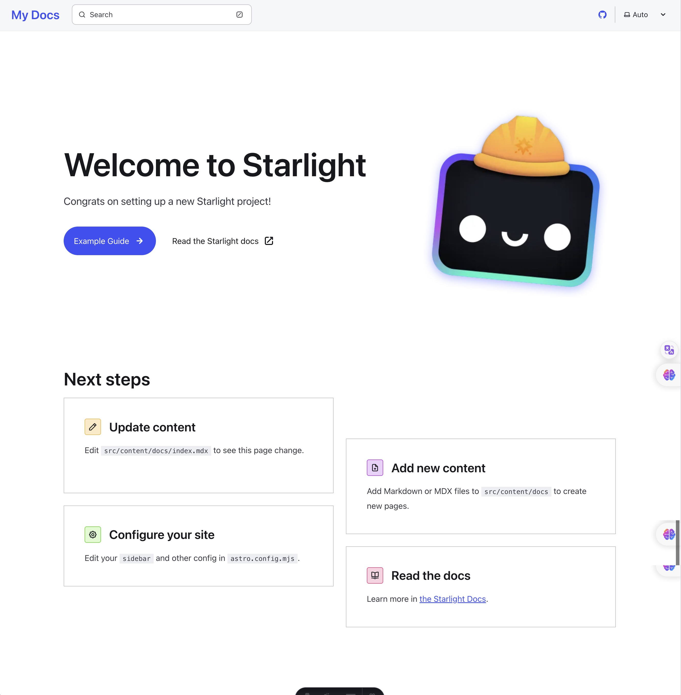
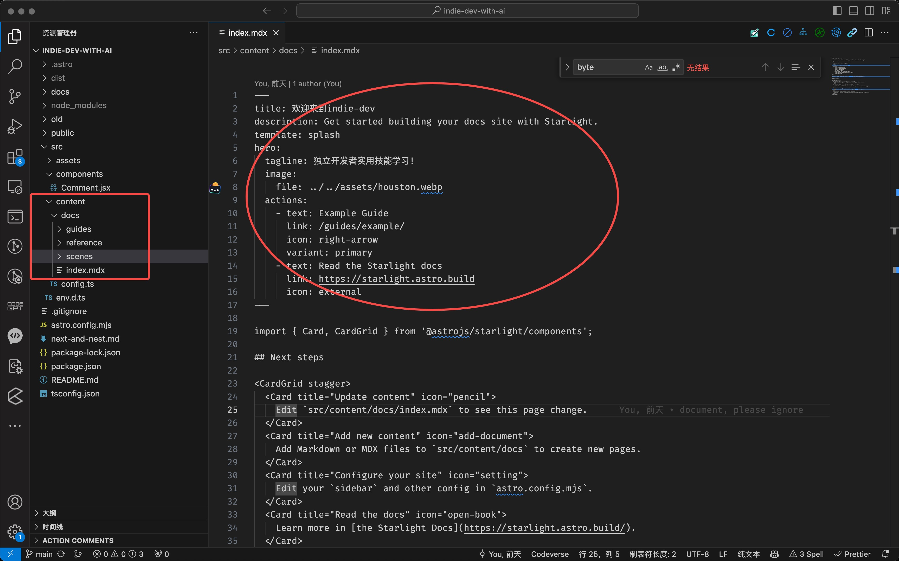
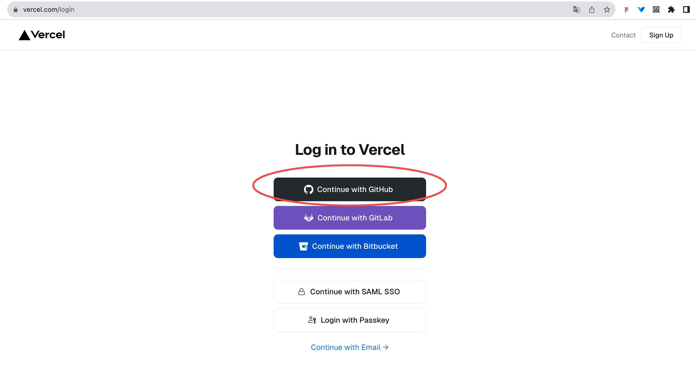
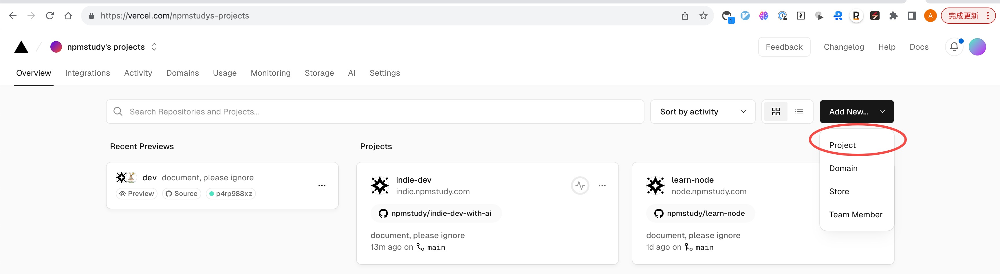
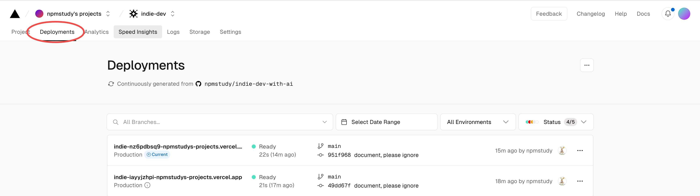
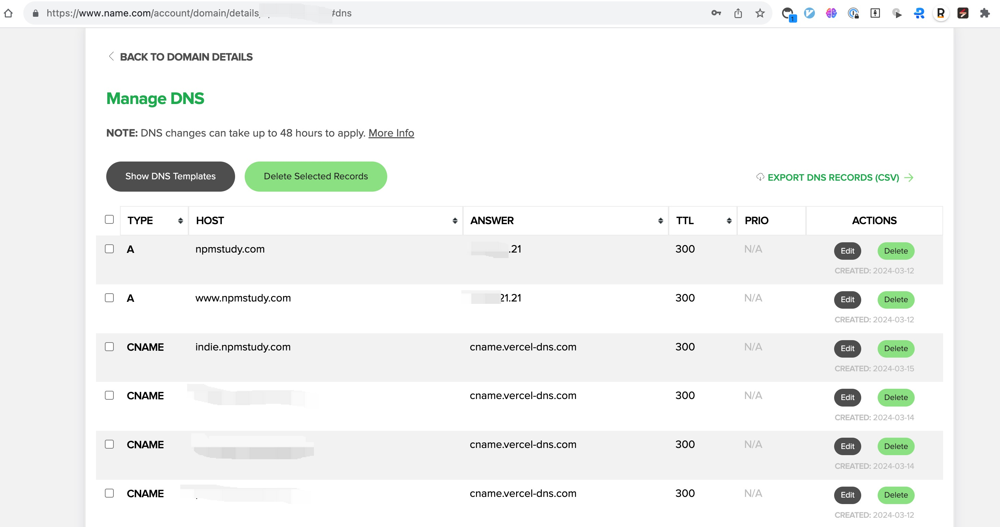
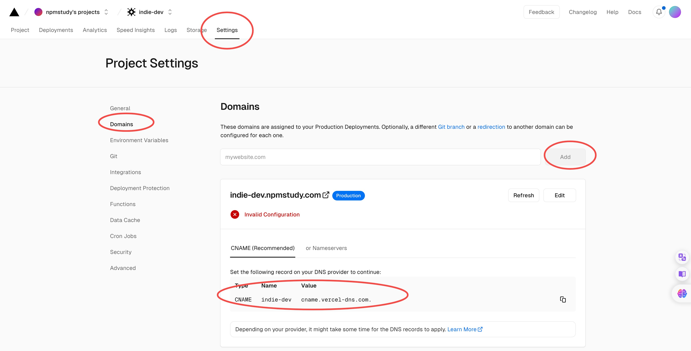

import { Card, CardGrid } from '@astrojs/starlight/components';

import Comments from '../../../components/Comment.jsx';

<CardGrid>
  <Card title="Starlight" icon="star">
    最简单写文档的工具
  </Card>
  <Card title="Vercel" icon="moon">
    最方便的和ci/cd集成的部署平台
  </Card>
</CardGrid>


## 使用Starlight创建项目

Starlight是Astro的文档模版。

```js
$ npm create astro@latest -- --template starlight
Need to install the following packages:
create-astro@4.7.4
Ok to proceed? (y)

 astro   Launch sequence initiated.

   dir   Where should we create your new project?
         ./site
      ◼  tmpl Using starlight as project template

    ts   Do you plan to write TypeScript?
         No
      ◼  No worries! TypeScript is supported in Astro by default,
         but you are free to continue writing JavaScript instead.

  deps   Install dependencies? (recommended)
         ● Yes  ○ No
   git   Initialize a new git repository?
         ● Yes  ○ No

 ██████  Project initializing...
         ▶ Template copying...
         □ Dependencies
         □ Git

 next   Liftoff confirmed. Explore your project!

         Enter your project directory using cd ./site
         Run npm run dev to start the dev server. CTRL+C to stop.
         Add frameworks like react or tailwind using astro add.

         Stuck? Join us at https://astro.build/chat

╭─────╮  Houston:
│ ◠ ◡ ◠  Good luck out there, astronaut! 🚀
╰─────╯
```

启动服务。如果上面你选了Install dependencies=yes，就不用手动执行npm install，如果=no，你需要手动执行npm install。

```
$ npm run dev

> site@0.0.1 dev
> astro dev

17:04:32 [vite] Port 4321 is in use, trying another one...

 astro  v4.5.4 ready in 1183 ms

┃ Local    http://localhost:4322/
┃ Network  use --host to expose

17:04:32 watching for file changes...
17:04:40 [200] / 384ms
```




## 理解Starlight

### 文件即路由

- 比如index.mdx对应的路由就是/
- 比如user.mdx对应的路由就是/user
- 比如/docs/user.mdx对应的路由就是/docs/user





### 支持的文件类型

参考Astro[官方文档](https://docs.astro.build/en/basics/astro-pages/)。

```js
Astro supports the following file types in the src/pages/ directory:

- .astro
- .md
- .mdx (with the MDX Integration installed)
- .html
- .js/.ts (as endpoints)
```

我一般喜欢

- 写文档推荐用mdx，原因是它可以和react、vue组件集成更方便。
- 写页面推荐用.js/.ts，原因是它react写的比较多。


## Vercel发布

Vercel 是一个云服务平台，支持静态网站和动态网站的应用部署、预览和上线。Vercel 自身内置 CI（持续集成）/CD(持续发布)，只要你将 Github 项目与 Vercel 关联，在 GitHub 项目进行代码推送，PR合并自动部署的目的，且你不需要考虑服务器部署问题。

Vercel 优势如下。

- 个人版永久免费，每个月 100G 带宽（别人访问你的项目所耗费的流量），个人项目部署完全够用，需要注意的是团队模式收费，所以要协作你只能付费。等你的项目需要付费了，你可能已经非常成功了。
- 内置 CI/CD，只需要将项目导入 Vercel ，一句命令自动部署。
- 因为内置构建流程，支持代码推送、PR 自动触发构建，不同分支唯一地址，方便测试。
支持本地、测试、生产三种环境部署，仅仅是命令区别，上手成本极低。
- 丰富的集成能力，项目部署自动监控，端到端自动化测试等等，当然这些并并属于 Vercel 自身的能力，但它可以为你提供集成入口，让这些成为你自动部署中自动进行的一步，比如构建生产后自动完成性能指标输出，自动化测试，以及后续项目监控等等。


### 登陆

我推荐用Github账户。




### 导入Github项目



再提交Github代码，就会自动触发Vercel的部署，非常方便。



一般我们会有test、pre、prod等环境，后面专门讲解。

### 绑定域名

1、域名，用a类接入




2、子域名，用cname接入



托管到vercel，所以vercel会自动检测

## 新增页面

和astro一样。

比如我在src/content/docs下新增空的fe.mdx，这时候编译会报错。

```
13:42:39 [ERROR] [InvalidContentEntryFrontmatterError] docs → fe.mdx frontmatter does not match collection schema.
title: Required
  Hint:
    See https://docs.astro.build/en/guides/content-collections/ for more information on content schemas.
  Error reference:
    https://docs.astro.build/en/reference/errors/invalid-content-entry-frontmatter-error/
  Stack trace:
    at getEntryData (file:///Users/npmstudy/workspace/npmstudy/indie-dev-with-ai/node_modules/astro/dist/content/utils.js:86:26)
    [...] See full stack trace in the browser, or rerun with --verbose.

```

原因是title不存在，但它又是必须的。astro这个Hint提示还不错。

此时在fe.mdx里增加下面一段文本即可。

```
---
title: 这是一篇react自学路径指南
description: A guide in react roadmap for self-study.
---
```

注意

- 放到最上面，空行都不能有。

更多配置项参考 https://starlight.astro.build/reference/frontmatter/。如果大家熟悉hugo等都是类似的，参考 https://gohugo.io/content-management/front-matter/。


## 使用内置组件

使用内置组件，文档 https://starlight.astro.build/guides/components/。内置组件都是平时写文档中我们最长使用的。

内置组件名单

- Tabs
- Cards
- Link Cards
- Asides
- Code
- File Tree
- Steps
- Icon

举个例子，本文档，最上面的代码即内置组件调用。

```js
import { Card, CardGrid } from '@astrojs/starlight/components';

import Comments from '../../../components/Comment.jsx';

<CardGrid>
  <Card title="Starlight" icon="star">
    最简单写文档的工具
  </Card>
  <Card title="Vercel" icon="moon">
    最方便的和ci/cd集成的部署平台
  </Card>
</CardGrid>
```


## 新增React组件


增加react支持，需要先安装react依赖的，此步骤必选。

```should
$ npx astro add react
```

官方文档里的组件用法，代码如下，它只是演示了如何应用.astro组件的用法。

```js
---
title: Welcome to my docs
---

import SomeComponent from '../../components/SomeComponent.astro';
import AnotherComponent from '../../components/AnotherComponent.astro';

<SomeComponent prop="something" />

<AnotherComponent>
  Components can also contain **nested content**.
</AnotherComponent>
```

.astro组件和react组件，其实没啥本质区别，唯一需要注意的就是组件加载声明周期控制，即使用client指令。

- `client:load` 它的意思Load and hydrate the component JavaScript immediately on page load.
- `client:only={string}` 回跳过HTML server-rendering, 并且只在client上渲染。

使用React组件，这里以评论为例

```
<Comments client:only="react" />
```

在src/components下新建Comment.jsx，这个评论服务，采用的是giscus，即基于github的discussions来实现的，数据存在github上，对于公开和面向开发的评论是比较友好的。

```js
// @ts-nocheck
import * as React from "react"
import Giscus from "@giscus/react"

const id = "inject-comments"

function getSavedTheme() {
  return window.localStorage.getItem("starlight-theme")
}

function getSystemTheme() {
  return window.matchMedia("(prefers-color-scheme: dark)").matches
    ? "dark"
    : "light"
}

const Comments = () => {
  const [mounted, setMounted] = React.useState(false)
  const [theme, setTheme] = React.useState(getSavedTheme() || getSystemTheme())

  React.useEffect(() => {
    // 监听主题变化
    const observer = new MutationObserver(() => {
      setTheme(getSavedTheme())
    })
    observer.observe(document.documentElement, {
      attributes: true,
      attributeFilter: ["data-theme"],
    })

    // 取消监听
    return () => {
      observer.disconnect()
    }
  }, [])

  React.useEffect(() => {
    setMounted(true)
  }, [])

  return (
    <div id={id} style={{ marginTop: "50px" }}>
      {mounted ? (
        <Giscus
          id={id}
          repo="npmstudy/indie-dev-with-ai"
          repoId="R_kgDOLgl_xw"
          category="Announcements"
          categoryId="DIC_kwDOLgl_x84CeBtg"
          mapping="pathname"
          reactionsEnabled="1"
          emitMetadata="0"
          inputPosition="top"
          lang="zh-CN"
          loading="lazy"
          theme={theme}
        />
      ) : null}
    </div>
  )
}

export default Comments
```
至于上面的配置，参考https://giscus.app/zh-CN。

- 先设置github repo，增加discussions
- 然后到https://giscus.app/zh-CN上，输入repo url，就会自动生成上面需要的参数
- 更新到组件中即可


这下面是演示的评论组件，也是可以真是用的。

<Comments client:only="react" />
